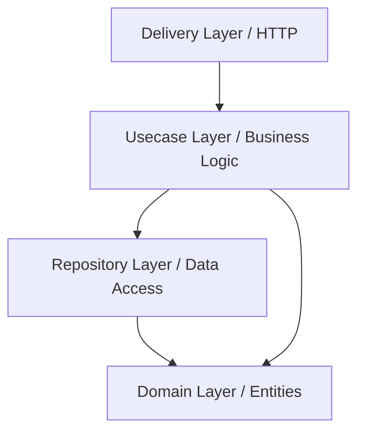

# Dating App Backend

A high-performance, scalable backend for a dating application built with Go, adhering to the principles of Clean Architecture.

## 🚀 Tech Stack

- **Language**: [Go](https://go.dev/) (1.26+)
- **Web Framework**: [Gin Gonic](https://github.com/gin-gonic/gin)
- **ORM**: [GORM](https://gorm.io/)
- **Database**: [PostgreSQL](https://www.postgresql.org/) (PostGIS enabled)
- **Cache**: [Redis](https://redis.io/)
- **Documentation**: [Swaggo](https://github.com/swaggo/swag)
- **Utilities**: JWT for auth, Bcrypt for password hashing.

## 🏗 Architecture

This project follows **Clean Architecture** to ensure separation of concerns, scalability, and ease of testing.



- **`internal/entities`**: Core business models (User, Profile, Photo).
- **`internal/usecases`**: Business logic orchestration.
- **`internal/repository`**: Data persistence interfaces and GORM implementations.
- **`internal/delivery/http`**: HTTP handlers, requests/responses DTOs.
- **`pkg`**: Shared utilities (Auth, JWT, etc.).

## 🔑 Key Features

- **Authentication System**:
  - Google OAuth Login with automatic **Account Linking**.
  - Email & Password Login/Registration.
  - JWT-based session management.
- **Standardized API Responses**: Centralized response envelope for consistency.
- **Scalable HTTP Layer**: Handlers and DTOs grouped by resource.
- **Database Migrations**: Automatic schema migration on startup.

## 🛠 Getting Started

### Prerequisites

- [Docker](https://www.docker.com/) & [Docker Compose](https://docs.docker.com/compose/)
- [Go](https://go.dev/doc/install) (1.20+)

### Setup

1. **Clone the repository**:
   ```bash
   git clone <repo-url>
   cd dating-backend
   ```

2. **Configure Environment Variables**:
   Copy the example environment file and adjust the values (especially database credentials).
   ```bash
   cp .env.example .env # If available, or create .env manually
   ```

3. **Start Infrastructure**:
   ```bash
   docker-compose up -d
   ```

4. **Install Dependencies**:
   ```bash
   go mod tidy
   ```

5. **Run the Application**:
   ```bash
   go run cmd/app/main.go
   ```

## 📖 API Documentation

The project uses Swagger for API documentation.

1. **Access Swagger UI**: [http://localhost:8080/swagger/index.html](http://localhost:8080/swagger/index.html)
2. **Regenerate Documentation** (after adding annotations):
   ```bash
   swag init -g cmd/app/main.go
   ```

## 🧪 Testing

```bash
go test ./...
```
