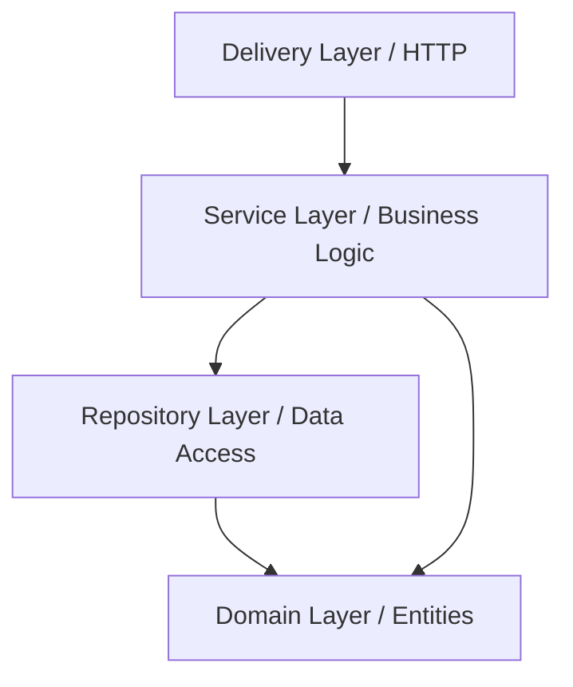

# Dating App Backend

A high-performance, scalable backend for a dating application built with Go, adhering to the principles of Clean Architecture.

## 🚀 Tech Stack

- **Language**: [Go](https://go.dev/) (1.26+)
- **Web Framework**: [Gin Gonic](https://github.com/gin-gonic/gin)
- **ORM**: [GORM](https://gorm.io/)
- **Database**: [PostgreSQL](https://www.postgresql.org/) (PostGIS enabled)
- **Cache**: [Redis](https://redis.io/)
- **Documentation**: [Swaggo](https://github.com/swaggo/swag)
- **Utilities**: JWT for auth, Bcrypt for password hashing.

## 🏗 Architecture

This project follows **Clean Architecture** to ensure separation of concerns, scalability, and ease of testing.


```mermaid
graph TD
    A[Delivery Layer / HTTP] --> B[Service Layer / Business Logic]
    B --> C[Repository Layer / Data Access]
    C --> D[Domain Layer / Entities]
    B --> D
```

### Layer Responsibilities

- **`internal/entities`**: Core business models (User, Profile, Photo).
- **`internal/services`**: Business logic orchestration.
- **`internal/repository`**: Data persistence interfaces and GORM implementations.
- **`internal/delivery/http`**: HTTP handlers, requests/responses DTOs.
- **`pkg`**: Shared utilities (Auth, JWT, etc.).

## 📁 Project Structure

```text
cmd/
├── migrate/           # Database migration tool
├── seed/              # Master data seeder
└── app/               # Main entry point (runs all versions)

internal/
├── background/        # Asynq task routers and job definitions
├── chat/              # WebSocket hub and communication logic
├── delivery/
│   └── http/
│       ├── dto/       # Shared and versioned DTOs
│       ├── handler/   # Versioned handlers (v1, v2)
│       └── middleware/# Auth, Anti-cheat, Cache
├── entities/          # Core domain models
├── infra/             # Core infrastructure (S3, FCM, ML, Postgres, Redis)
├── providers/         # External service providers
├── repository/        # Data access layer
├── routes/            # Global and versioned route registration
└── services/          # Pure business logic layer
```

## 🔑 Key Features

- **Authentication System**:
  - Google OAuth Login with automatic **Account Linking**.
  - Email & Password Login/Registration.
  - JWT-based session management.
- **Standardized API Responses**: Centralized response envelope for consistency.
- **Scalable HTTP Layer**: Handlers and DTOs grouped by resource.
- **Database Migrations**: Versioned SQL migrations using `golang-migrate`.

## 🛠 Getting Started

### Prerequisites

- [Docker](https://www.docker.com/) & [Docker Compose](https://docs.docker.com/compose/)
- [Go](https://go.dev/doc/install) (1.20+)

### Setup

1. **Clone the repository**:
   ```bash
   git clone <repo-url>
   cd dating-backend
   ```

2. **Configure Environment Variables**:
   Copy the example environment file and adjust the values (especially database credentials).
   ```bash
   cp .env.example .env
   ```

3. **Start Infrastructure**:
   ```bash
   docker-compose up -d
   ```

4. **Install Dependencies**:
   ```bash
   go mod tidy
   ```

5. **Database Migrations & Seeding**:
   Migrations and seeding are now manual. Refer to the commands below:
   ```bash
   # Run all pending migrations
   go run cmd/migrate/main.go up

   # Rollback one step (Undo the last migration)
   go run cmd/migrate/main.go step -1

   # Full Rollback (CAUTION: Removes all tables!)
   go run cmd/migrate/main.go down

   # Seed master data
   go run cmd/seed/main.go
   ```

6. **Run the Application**:
   ```bash
   go run cmd/app/main.go
   ```

## 📖 API Documentation

The project uses Swagger UI with per-version documentation.

| Version | URL |
| :--- | :--- |
| **V1** | [http://localhost:8080/swagger/index.html](http://localhost:8080/swagger/index.html) |

Use the **"Select a definition"** dropdown at the top right of the Swagger UI to switch between API versions. Defaults to **V1 - Current**.

### Regenerate Swagger Docs

```bash
# Regenerate docs (run from project root)
swag init -g cmd/app/main.go -o docs
```

## 🌐 Environment & Development

This project supports separate **development** and **production** environments.

### 🏁 Running the App

Using the **Makefile**:
- **Development**: `make dev` (Uses `.env.development` and `swipee://` deep links)
- **Production**: `make prod` (Uses `.env.production` and `https://swipee.app` universal links)

### 🛠 Development with ngrok

Whenever you restart ngrok, you must update the tunnel URLs:

1.  **Backend**: Update `BASE_URL` in `dating-backend/.env.development` and restart with `make dev`.
2.  **Mobile**: Update `EXPO_PUBLIC_API_URL` in `dating-mobile/.env.development`.
3.  **Mobile Switch**: Use `npm run start:dev` to load the development environment.

## 🧪 Testing

```bash
go test ./...
```

## 🛠 Extra Commands

### Advanced Migrations
For more granular control over database migrations:

```bash
# Check current migration version
go run cmd/migrate/main.go version

# Rollback exactly 1 migration step
go run cmd/migrate/main.go step -1

# Run exactly 1 next migration step
go run cmd/migrate/main.go step 1

# Force a specific version (use this if the database is in a 'dirty' state)
go run cmd/migrate/main.go force <version_number>
```

## 🚀 Production Deployment (Docker Hub & VPS)

We use an optimized deployment strategy where the Go Backend is built locally on a Mac (Cross-Compiled to Linux AMD64) and pushed to Docker Hub as a highly minimalistic image (<50MB). To save space and bandwidth, we do not include large ML models (ONNX) into the image, but instead download and bind-mount them natively on the VPS Host.

### 1. Build & Push Image (Local / Macbook)

1. Ensure the vendor dependencies and the exact Go version (`v1.26.0` & `onnxruntime_go v1.15.0`) are solid:
   ```bash
   go mod vendor
   ```
2. Build and push the image using Docker Buildx for Cross-Compilation Architecture (`linux/amd64`):
   ```bash
   docker buildx build \
     --platform linux/amd64 \
     -f Dockerfile.prod \
     -t dockerpipigendut/dating-backend:latest \
     --push \
     .
   ```

### 2. VPS Preparation (Host Server)

1. **SSH** into your Ubuntu Server and prepare the working directory:
   ```bash
   mkdir -p ~/app
   cd ~/app
   ```
2. Upload the necessary configuration and migration files from your Local Mac:
   ```bash
   # From Mac Terminal
   scp -i key.pem docker-compose.prod.yml ubuntu@<YOUR_VPS_IP>:~/app/
   scp -i key.pem .env.production ubuntu@<YOUR_VPS_IP>:~/app/
   scp -i key.pem firebase-service-account-prod.json ubuntu@<YOUR_VPS_IP>:~/app/
   scp -r -i key.pem ./migrations ubuntu@<YOUR_VPS_IP>:~/app/
   scp -i key.pem ./scripts/setup_ml.sh ubuntu@<YOUR_VPS_IP>:~/app/setup_ml.sh
   ```
3. Prepare the Machine Learning directory inside the VPS natively (downloads `lib/` and `models/` into `~/app/`):
   ```bash
   # From VPS Terminal
   cd ~/app
   bash setup_ml.sh
   ```

### 3. Deploy & Run

Pull the lightweight Docker Image and start the services. It will automatically wait for the PostgreSQL database to be healthy, run the Database Migrations, and then start the Go App smoothly.

```bash
cd ~/app
# Pull the latest thin image from Docker Hub
sudo docker compose --env-file .env.production -f docker-compose.prod.yml pull

# Run everything in detached mode
sudo docker compose --env-file .env.production -f docker-compose.prod.yml up -d

# Check logs
sudo docker compose -f docker-compose.prod.yml logs -f
```

### 4. Native Nginx Reverse Proxy & SSL (VPS Host)

The backend runs inside Docker but exposes port `8080` locally (`127.0.0.1:8080`). To hook it to a domain with SSL, we install Nginx directly on the VPS Host (not inside Docker) to save RAM and CPU.

1. **Install Nginx & Certbot**:
   ```bash
   sudo apt update
   sudo apt install nginx python3-certbot-nginx
   ```

2. **Create Nginx Server Block**:
   Create a new file `/etc/nginx/sites-available/api.swipee` (Adjust the domain to yours):
   ```bash
   sudo nano /etc/nginx/sites-available/api.swipee
   ```
   Paste this optimized reverse-proxy configuration:
   ```nginx
   server {
       listen 80;
       server_name api.swipee.pipigendut.space; # CHANGE THIS TO YOUR DOMAIN

       location / {
           proxy_pass http://127.0.0.1:8080;
           proxy_http_version 1.1;
           proxy_set_header Upgrade $http_upgrade;
           proxy_set_header Connection 'upgrade';
           proxy_set_header Host $host;
           proxy_set_header X-Real-IP $remote_addr;
           proxy_set_header X-Forwarded-For $proxy_add_x_forwarded_for;
           proxy_cache_bypass $http_upgrade;
       }
   }
   ```

3. **Enable and Restart Nginx**:
   ```bash
   sudo ln -s /etc/nginx/sites-available/api.swipee /etc/nginx/sites-enabled/
   sudo nginx -t
   sudo systemctl reload nginx
   ```

4. **Generate Auto-Renewing SSL Certificate (HTTPS)**:
   ```bash
   sudo certbot --nginx -d api.swipee.pipigendut.space
   ```
   *(Certbot will automatically edit your Nginx config to serve HTTPS on port 443).*


### Run seeder
```bash
#tunneling
ssh -i /Users/pipigendut/Project/personal/akbar/dating-project/swipee-key.pem -N -L 5433:127.0.0.1:5432 ubuntu@13.212.117.42

#in new terminal
DB_HOST=127.0.0.1 DB_USER=postgres DB_PASSWORD=password DB_NAME=dating_app DB_PORT=5433 go run cmd/seed/main.go
```